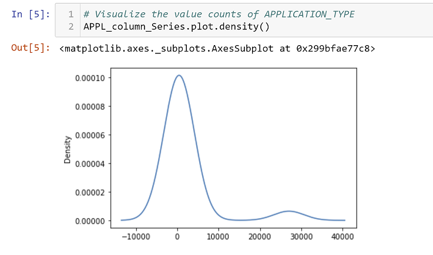
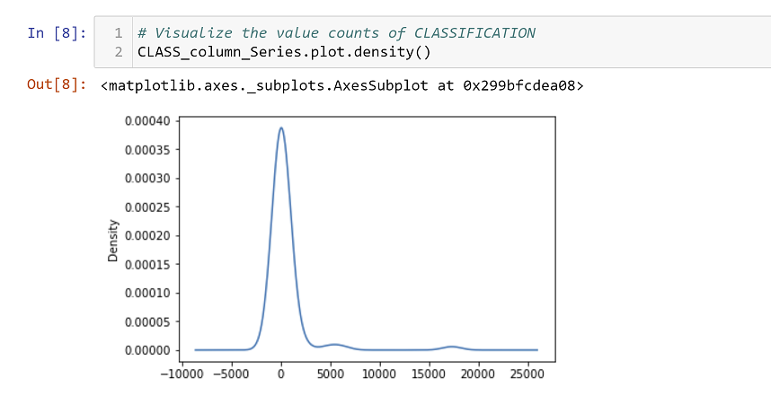

# Neural_Network_Charity_Analysis

## Analysis Overview
This project requires applying knowledge of machine learning and neural networks. A dataset was provided (charity_data.csv) by Alphabet Soup's business team for analysis. I assisted with using the features of the dataset to create a binary classifier capable of predicting whether applicant organizations will be successful if funded by Alphabet Soup Foundation. The dataset contains more than 34,00 organizations who have received funding from Alphabet Soup over the years. 

The dataset was read into a Jupyter Notebook enviroment using a mlenv type file where it was prepocessed using density plots to visualize the value counts of target variables, fit and transform was performed on a variable list using OneHotEncoder, and processed data was split into feature and target arrays, and then split again into a training and testing dataset. A Scikit_Learn StandardScaler instance was created, the data was scaled, compiled, trained and tested for use in the neural network. The data was trained with a sequencial neural network model and throughout the analysis different numbers of layers, various amounts of nodes and several activation functions were applied to the dataset for predicting reliability and evaluating the model for the highest level of optimization.  

## Results 
The following bulleted questions and images (located below the answer) will provide support for the results of this project:

### Data Preprocessing

-- What variable(s) are considered the target(s) for your model?
   
   One of the columns in the dataset titled "IS_SUCCESSFUL" is the target for the model. The column displays either the number '1' or '0' to denote 'yes' or 'no' in                reference to the probability of the organization being successful if funded by Alphabet Soup Foundation.
   
   
    
-- What variable(s) are considered to be the features for your model?
   
   The columns of the dataset are considered the features for this model. 
   
   
    
-- What variable(s) are neither targets nor features, and should be removed from the input data?
   
   Two columns were removed from the model, 'EIN' and 'NAME' because the information they provided is not essential for predicting success of future funding.
   
   

### Compiling, Training, and Evaluating the Model
-- How many neurons, layers, and activation functions did you select for your neural network model, and why?
   
   This model has two phases of compiling, training, and evaluating. The first phase utilized two hidden layers and one outer layer. The neurons were arranged with 80 in the        first layer, 30 in the second layer, and 1 in the third layer. Three activation functions were used in the first phase: 'relu', 'sigmoid', and 'linear'. The training epochs      was set at 10.
   
   
    
-- Were you able to achieve the target model performance?
   
   I was not able to achieve the target model preformance in the first phase. The highest accuracy evaluated by the model was .7252
   
   

-- What steps did you take to try and increase model performance?
   
   In the second phase I attempted to optimize the model by adding hidden layers, reducing the number of neurons, increasing the epochs, and using the same activation function      for every layer of the model. I was able to increase the model performance to .7321, but only once, which I considered to be an annomily. The sustainable result that the        model performed is .7271 and was repeated several times. I changed the number of hidden layers, number of neorons and epochs several times, but was not able to create a          result that increased the performance of the deep learning model to reach the .7500 mark. 
   
   
   
   

## Summary
In summary, I believe there are a few reasons for the performance of the model. First, in the 'APPLICATION_TYPE' column there is a higher density of values with a unique count from 0 to 10,000. The graph visualizes which values could be joined to possibly create a less congested encoded dataframe. 'Noise', unnecessary data, creates the possibility of reducing the accuracy of the model's performance. There is reason for concern, in my opinion, that the dataset contains more data than is necessary for predicting success. 

Second, a grpah of the 'CLASSIFICATION' column in the dataset visualizes a significant spike in unique values between 0 to 2500. I believe this may indicate that the data would perform more efficiently when grouped into one column. 

Finally, I believe the model's performance was overfitted when I increased the number of hidden layers, the number of neurons, and the number of epochs. In this sense, more is not better. I would reccomend reducing the amount of unnecessary data, limit the hidden layers to two due to the size of the dataset and reduce the number of nodes and epochs. Since the amount of data is limited to past organizations who were funded by Alphabet Soup Foundation it makes no sense, in my opinion, to increase the amount of data in the dataset for better perfprmance. Rather, the reduction of noise, eliminating unecessary data from the dataset would, in my opinion, create the best results for predicting the success of future funding.
