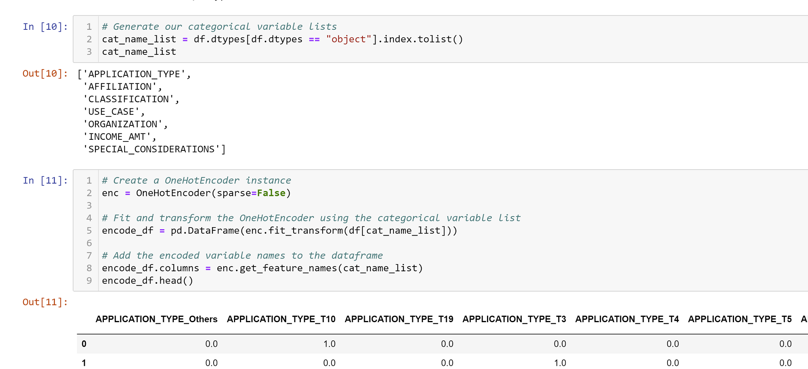

# Neural_Network_Charity_Analysis

## Analysis Overview
This project requires using knowledge of machine learning and neural networks. A dataset was provided (charity_data.csv) by Aplphabet Soup's business team for analysis. I assisted with using the features of the dataset to create a binary classifier capable of predicting whether applicants will be successful if funded by Alphabet Soup Foundation. The dataset contains more than 34,00 organizations who have received funding from Alphabet Soup over the years. 

The dataset was read into a Jupyter Notebook enviroment using a mlenv type file where it was prepocessed using density plots to visualize the value counts of target variables, fit and transform was performed on a variable list using OneHotEncoder, and processed data was split into faeture and taget arrays and then split again into a training and testing dataset. A StandardScaler instance was created, the data was scaled, compiled, trained and tested for use in the neural network. The data was trained with a sequencial neural network model and throughout the analysis different numbers of layers, various amounts of nodes and several activation functions were applied to the dataset for predicting reliability and evaluating the model for the highest level of optimization.  

## Results 
The following bulleted questions and images will provide support for the results of this project:

### Data Preprocessing

-- What variable(s) are considered the target(s) for your model?
   
   One of the columns in the dataset titled "IS_SUCCESSFUL" is the target for the model. The column displays either the number '1' or '0' to denote 'yes' or 'no' in                reference to the probability of the organization being successful if funded by Alphabet Soup Foundation.
   
   
    
-- What variable(s) are considered to be the features for your model?
   
   The columns of the dataset are the variables and are considered the features for this model. 
   
   
    
-- What variable(s) are neither targets nor features, and should be removed from the input data?
   
   Two columns were removed from the model, 'EIN' and 'NAME' because the information they provided is not essential for predicting success of future funding.
   
   

### Compiling, Training, and Evaluating the Model
-- How many neurons, layers, and activation functions did you select for your neural network model, and why?
   
   This model has two phases of compiling, training, and evaluating. The first phase utilized two hidden layers and one outer layer. The neurons were arranged with 80 in the        first layer, 30 in the second layer, and 1 in the third layer. Three activation functions were used in the first phase: 'relu', 'sigmoid', and 'linear'. The training epochs was set at 10.
   
   
    
-- Were you able to achieve the target model performance?
   
   I was not able to achieve the target model preformance in the first phase. The highest accuracy evaluated by the model was .7252
   
   

-- What steps did you take to try and increase model performance?
   
   The second phase 
   
   
   
   
## Summary
Summarize the overall results of the deep learning model. Include a recommendation for how a different model could solve this classification problem, and explain your recommendation.

There is a recommendation on using a different model to solve the classification problem, and justification (3 pt)
